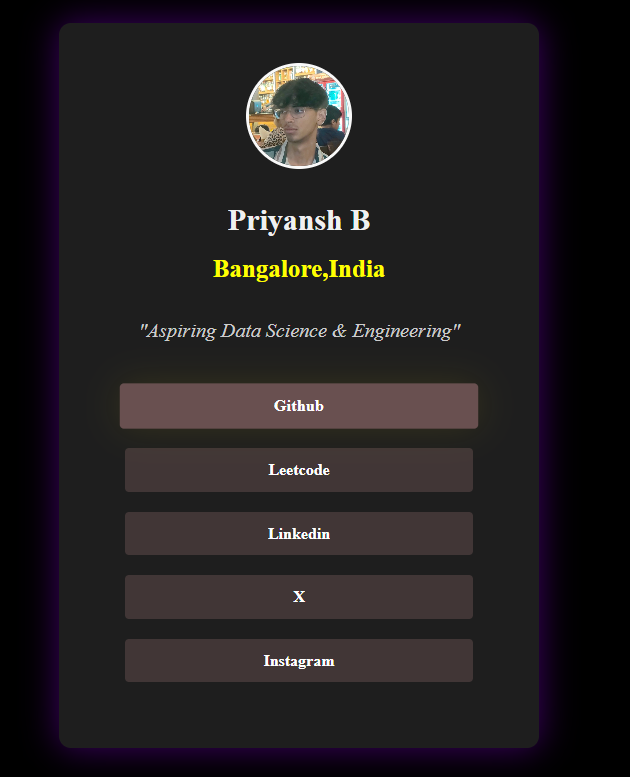

# 👤 Priyansh B - Developer Profile Card

A simple, clean **profile card webpage** built with HTML and CSS.  
This project displays basic personal details, a profile picture, and social media links — styled as a centered card layout.

## 📸 Preview

 <!-- (Optional: Upload screenshot image and name it 'screenshot.png') -->

## 🚀 Features

- Responsive centered card layout
- Profile picture with hover styling
- Clean, modern social links with hover effects
- Minimalist design with dark background theme
- Built using pure HTML and CSS

## 🛠 Tech Stack

- HTML5
- CSS3 (Flexbox)

## 💡 What I Learned

- How to center elements using Flexbox
- Card UI styling and spacing
- Image styling using `border-radius`, `object-fit`, and box shadows
- Using `:hover` and `transition` for clean effects

## 🌐 Live Demo

[View it here](https://priyansh-c.github.io/Profile-website/) <!-- Replace with your GitHub Pages URL -->
## 🧑‍💻 Author

**Priyansh B**  
📍 Bangalore, India  
_“Aspiring Data Science & Engineering”_

---

